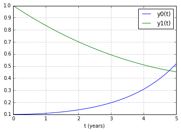
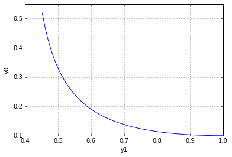

UECM3033 Assignment #3 Report
========================================================

- Prepared by: ** Jesslyn Kho Hui Yee **
- Tutorial Group: T3

--------------------------------------------------------

## Task 1 --  Gauss-Legendre formula

The reports, codes and supporting documents are to be uploaded to Github at: 

[https://github.com/jesslynk/UECM3033_assign3](https://github.com/jesslynk/UECM3033_assign3)

Explain how you implement your task1.py here.

Obtaining the weights and nodes by using the numpy.polynomial.legendre.leggauss(deg) for each node. Then, transfer the domain of [-1,1] to new domain [a,b].

Explain how you get the weights and nodes used in the Gauss-Legendre quadrature.

By using numpy.polynomial.legendre.leggauss(deg) where 'deg' is the number of nodes, weights and nodes can be obtained.
---------------------------------------------------------

## Task 2 -- Predator-prey model

Explain how you implement your task2.py here, especially how to use odeint.

ODE and the initial state are defined firstly then pass into the odeint function. The basic usage of odeint is odeint(func, y0, t, args=(a, b)). func is a function definition of the derivative of y at t0, y0 is the initial state, t is the time points for which to solve for y, and args is extra arguments to pass to function.

y0 is the initial state of [y0(0),y1(0)], t will be the time point from 0 to 5years, and args(a,b) will be [1.0, 0.2].

Fitting all these parameters into odeint, it will return the state of y at all the time points.

The graph of the state of both y0 and y1 at each time points was plotted.

It can be observed that the number of y0 is decreasing while the number of y1 is decreasing over these 5 years period.

Graph of y1 against y0 is plotted as shown below:

Is the system of ODE sensitive to initial condition? Explain.

Here, the initial condition of y0 is slightly increasing from 0.1 to 0.11. The same group mentioned above is plotted as shown below:

In short, we can see that the system is not sensitive to initial condition as the pattern of the graph are still preserved.
-----------------------------------

last modified: 18/4/16
